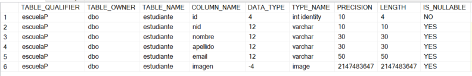
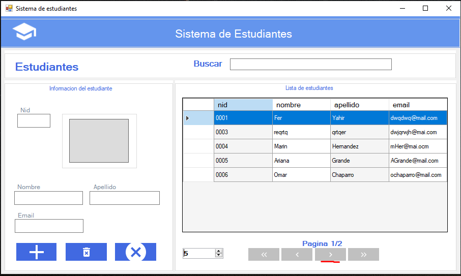
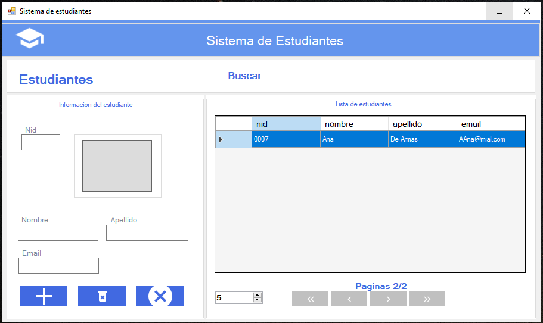
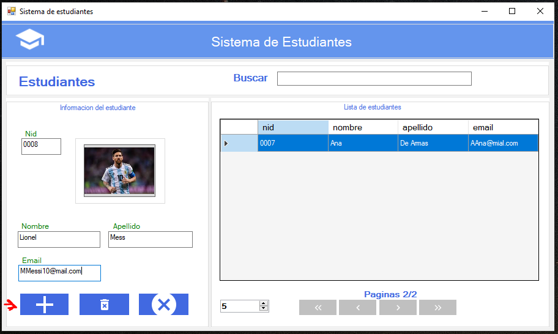
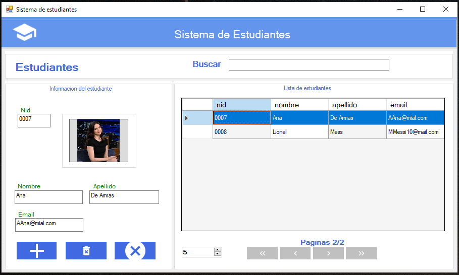

# Aplicación de WinForm con C#.NET de Estudiantes

## Requisitos (Conocimientos):
- base de datos y manipulación.
- lenguaje de programación C#
- .Net Framework

## Herramientas:
- Visual Studio
- SQL SERVER
- SQL Management Studio

Es importante saber que para que muchos de los elementos que se pueden llegar a mostrar se tienen que llegar a realizar primero poniendo los componentes como es un 'button', 'label', 'input', etc. Y asignar un nombre a cada uno de estos elementos, cambiando a sí también sus propiedades en el código fuentes de estas forms.cs.

## Tabla de Esdudiantes en Base de Datos
También es importante destacar cómo esta desarrollada la tabla de la base de datos, así que su configuración es la siguiente:

## Resultado del proyecto
### Listado de Esdudiantes registrados

### Añadir nuevo Estudiante

### Editar nuevo Estudiante

### Eliminar contacto
Solo es seleccionar al estudiante que se desea eliminar y presionar el botón con el icono de eliminar.